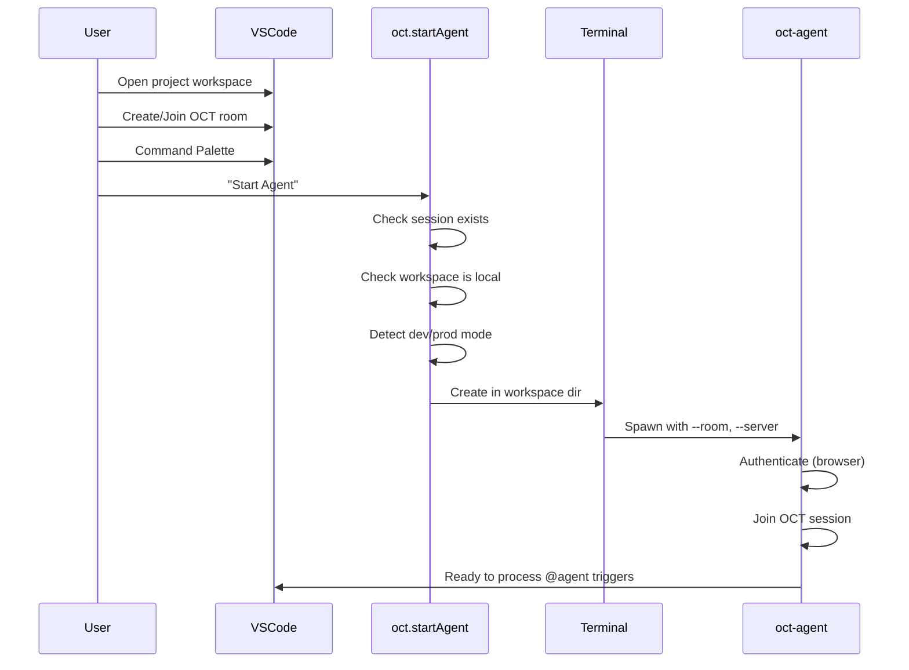

# Agent Client Protocol (ACP) Concept

**Status:** 📝 DRAFT (v4)
**Date:** 2025-11-21

## Objective

The **Agent Client Protocol (ACP)** is a communication standard that allows an **AI Agent** (like Claude Code, a custom CLI agent, or an IDE plugin) to connect directly to an **Open Collaboration Tools (OCT) Session** as a first-class participant.

## Architecture

The `oct-agent` CLI connects exclusively via **ACP** (Agent Client Protocol):

*   **Technology:** Agent Client Protocol (ACP).
*   **Behavior:** The `oct-agent` acts as a **bridge**. It connects to the OCT session and forwards all triggers/events to an external ACP agent (default: `npx @zed-industries/claude-code-acp`). Override with `--acp-agent` to use any ACP-capable agent.
*   **Use Case:** Claude Code, Cursor, or custom enterprise agents; model and API keys are configured in the ACP agent, not in oct-agent.

*(Previously, a built-in Embedded mode existed; it was removed in favor of ACP-only.)*

## Integration with `zed-industries/claude-code-acp`

We have discovered an existing ACP adapter for Claude Code: [`zed-industries/claude-code-acp`](https://github.com/zed-industries/claude-code-acp). This tool wraps the Claude Code SDK and exposes it as an ACP server (stdio or socket).

This simplifies our architecture significantly!

### The Workflow

1.  **User starts OCT Agent:**
    ```bash
    oct-agent --room <ROOM_ID>
    ```

2.  **OCT Agent (The Bridge):**
    *   Connects to the OCT Session (WebSocket).
    *   Spawns the ACP Adapter (`npx @zed-industries/claude-code-acp`) as a child process.
    *   **Pipes** ACP messages between the OCT Session and the ACP Adapter.

3.  **Data Flow:**
    *   **OCT:** `@agent refactor this` (Trigger)
    *   **OCT Agent:** Wraps this in an ACP `agent/trigger` message.
    *   **ACP Adapter:** Receives message, calls Claude Code SDK.
    *   **Claude Code:** Executes logic, maybe asks for permissions.
    *   **ACP Adapter:** Sends `agent/response` or `agent/action`.
    *   **OCT Agent:** Forwards to OCT Session (applies edits via Yjs).

### Protocol Definition (ACP)

ACP is a set of message types exchanged over the OCT transport (WebSocket).

#### 1. `agent/trigger` (Inbound to Agent)

Sent when the OCT system detects an intent for the agent to act.

```json
{
  "type": "agent/trigger",
  "id": "trig-123",
  "source": {
    "type": "document",
    "path": "src/main.ts",
    "line": 42
  },
  "content": {
    "prompt": "refactor this function",
    "context": "..." // Optional: Immediate context if available
  }
}
```

#### 2. `agent/action` (Outbound from Agent)

The agent performs an action in the session.

```json
{
  "type": "agent/action",
  "triggerId": "trig-123", // Correlate with the trigger
  "action": "edit",
  "payload": {
    "file": "src/main.ts",
    "edits": [ ... ]
  }
}
```

## VSCode Extension Integration

The VSCode extension now provides a convenient command to start the agent directly from the IDE:

### Starting the Agent from VSCode

1. Create or join an OCT room in VSCode
2. Open Command Palette (Cmd+Shift+P)
3. Run: "Open Collaboration Tools: Start Agent"
4. The agent automatically starts in your workspace directory with the correct room ID and server URL

### Implementation Details

- **Command:** `oct.startAgent`
- **Automatically detects** development vs production environment
- **Development:** Uses local build from mono-repo (`../open-collaboration-agent/bin/agent`)
- **Production:** Uses `npx open-collaboration-agent`
- **Agent runs** in workspace directory via VSCode terminal
- **All configuration** (room ID, server URL) passed automatically

### Workspace Requirement

**IMPORTANT:** The agent MUST run in the same workspace directory as the OCT session because:

- File system operations use `fs.readFileSync` for reading local files
- Agent uses `process.cwd()` as workspace context
- No remote file streaming - files are read from local filesystem
- See `REMOTE_AGENT_CHALLENGES.md` for details about deployment scenarios

### How It Works



## Implementation

The `oct-agent` always uses the ACP bridge:

*   **Logic:** Spawns the ACP agent (default: `npx @zed-industries/claude-code-acp`) as a child process. Override with `--acp-agent`.
*   **Flow:**
    1.  `DocumentSync` detects trigger.
    2.  `oct-agent` converts trigger to ACP JSON message (`agent/trigger`).
    3.  `oct-agent` writes JSON to child process `stdin`.
    4.  Child process (e.g. Zed Adapter) calls Claude Code SDK.
    5.  Child process writes response JSON (`agent/action`) to `stdout`.
    6.  `oct-agent` reads JSON and applies edits via `DocumentSync`.

## Benefits

1.  **Simplicity:** One code path; no mode switch.
2.  **Flexibility:** Any ACP-capable agent via `--acp-agent`.
3.  **Unified CLI:** One tool (`oct-agent`) for all ACP-based integrations.
