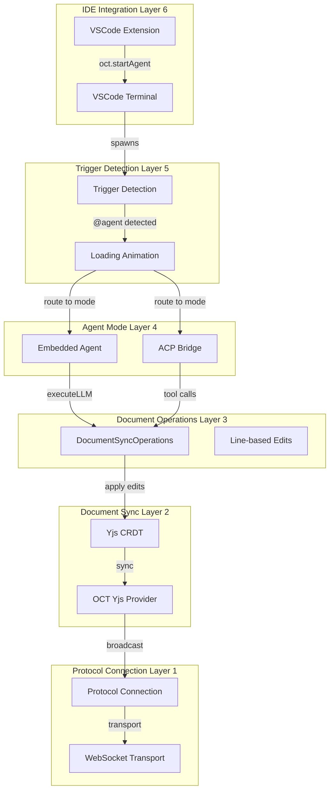
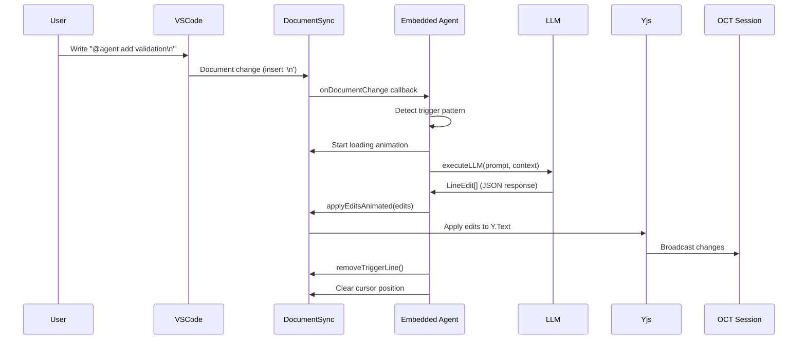
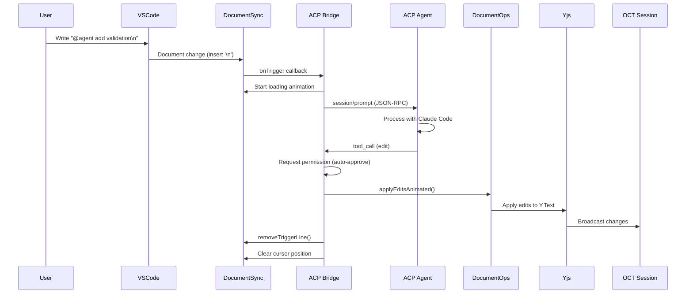

# Open Collaboration Agent: Architecture

**Date:** 2025-01-19
**Status:** Current Implementation

## Overview

The open-collaboration-agent enables AI agents to participate in Open Collaboration Tools (OCT) sessions as first-class peers, with real-time code editing capabilities. The agent can operate in two modes:

- **Embedded Mode**: Direct LLM integration (Anthropic, OpenAI) with hardwired workflow
- **ACP Mode**: External agent integration via Agent Client Protocol (e.g., Claude Code)

## Architectural Layers



## Layer 1: Protocol Connection

**Purpose:** Establish and maintain connection to OCT server

**Components:**
- `ProtocolBroadcastConnection` from `open-collaboration-protocol`
- WebSocket transport via Socket.IO
- Authentication flow (browser-based login)
- Peer identity management

**Key Operations:**
- Login to server
- Join room with room token
- Maintain connection with auto-reconnect
- Peer awareness (cursor tracking, active document)

**Code Location:** `src/agent.ts` (lines 25-65)

## Layer 2: Document Synchronization (Yjs CRDT)

**Purpose:** Real-time collaborative document editing with conflict-free merging

**Components:**
- `DocumentSync` class (`src/document-sync.ts`)
- Yjs `Y.Doc` and `Y.Text` for document state
- `OpenCollaborationYjsProvider` for OCT protocol integration
- Awareness protocol for cursor positions

**Key Features:**
- Follows host's active document automatically
- Detects document changes with position tracking
- Provides callbacks for `@agent` trigger detection
- Conflict-free merge of concurrent edits (CRDT)

**Code Location:** `src/document-sync.ts`

## Layer 3: Document Operations Abstraction

**Purpose:** Unified interface for document manipulation shared by all modes

**Components:**
- `DocumentOperations` interface (`src/document-operations.ts`)
- `DocumentSyncOperations` implementation
- `LineEdit` type for structured edits

**Operations:**
```typescript
interface DocumentOperations {
    getDocument(path: string): string | undefined
    getDocumentRange(path: string, startLine: number, endLine: number): string[]
    applyEdit(path: string, edit: LineEdit): void
    applyEditsAnimated(path: string, edits: LineEdit[]): Promise<void>
    removeTriggerLine(path: string, trigger: string): void
    updateCursor(path: string, offset: number): void
    getSessionInfo(): SessionInfo
}
```

**Benefits:**
- Single source of truth for document operations
- Shared by embedded agent, ACP bridge, and MCP server
- Animated cursor movement during edits
- Line-based editing (easier for LLMs than character offsets)

**Code Location:** `src/document-operations.ts`

## Layer 4: Agent Modes

### Mode A: Embedded Agent

**Purpose:** Direct LLM integration with hardwired workflow (optimized for efficiency)

**Flow:**
```
Trigger → executeLLM() → LineEdit[] → applyEditsAnimated() → removeTriggerLine()
```

**Components:**
- `runAgent()` in `src/agent.ts`
- `executeLLM()` in `src/prompt.ts`
- Direct API calls to Anthropic/OpenAI

**Advantages:**
- Faster execution (no tool call overhead)
- Lower token usage (direct JSON response)
- Simpler prompt engineering
- Ideal for standalone CLI usage

**Code Location:** `src/agent.ts` (lines 293-310)

### Mode B: ACP Bridge

**Purpose:** Bridge to external agents via Agent Client Protocol

**Flow:**
```
Trigger → ACPBridge.sendTrigger() → ACP Agent → session/prompt → tool calls → edits
```

**Components:**
- `ACPBridge` class (`src/acp-bridge.ts`)
- JSON-RPC over stdio communication
- Integration with `@zed-industries/claude-code-acp`

**Features:**
- Spawns external ACP agent as child process
- Session management (initialize, create session)
- File system operations (fs/read_text_file, fs/write_text_file)
- Permission handling (auto-approve tool calls)
- Bidirectional communication (server → agent, agent → server)

**Advantages:**
- Standard protocol (works with any ACP client)
- Flexible tool-based workflows
- External agent can use advanced capabilities
- Proper bidirectional communication

**Code Location:** `src/acp-bridge.ts`

## Layer 5: Trigger Detection & Execution

**Purpose:** Detect `@agent` mentions and orchestrate execution

**Components:**
- `setupTriggerDetection()` in `src/agent.ts`
- Document change handler
- Loading animation (`animateLoadingIndicator()`)
- Trigger line detection (newline after `@agent`)

**Detection Logic:**
```typescript
// Detects pattern: "@agent <prompt>\n"
if (change.type === 'insert' && change.text === '\n') {
    const completedLine = docLines[change.position.line];
    const triggerIndex = completedLine?.indexOf('@agent');
    if (triggerIndex !== -1) {
        const prompt = completedLine.substring(triggerIndex + 6).trim();
        // Execute agent with prompt
    }
}
```

**Workflow:**
1. Monitor document changes via `DocumentSync.onDocumentChange()`
2. Detect newline insertion after `@agent` pattern
3. Extract prompt text
4. Start loading animation at trigger position
5. Route to appropriate agent mode (embedded or ACP)
6. Apply edits with animated cursor
7. Remove trigger line
8. Clear cursor position

**Code Location:** `src/agent.ts` (lines 125-291)

## Layer 6: IDE Integration (VSCode Extension)

**Purpose:** Seamless agent launching from VSCode

**Components:**
- Command: `oct.startAgent` in VSCode extension
- Terminal integration
- Automatic configuration passing

**Workflow:**
```
User runs command → VSCode creates terminal → Agent starts in workspace directory
```

**Implementation Details:**
- Detects development vs production environment
- Development: Uses local build path
- Production: Uses `npx open-collaboration-agent`
- Automatically passes room ID, server URL, and mode
- Agent runs in workspace directory (`cwd: workspaceFolder.uri.fsPath`)

**Code Location:** `packages/open-collaboration-vscode/src/commands.ts` (lines 221-265)

## Data Flow Diagrams

### Embedded Mode: Trigger Processing



### ACP Mode: Trigger Processing



## Filesystem Architecture

### Current Design: Local Filesystem Access

```
┌─────────────────────────────────────────┐
│         User's Workspace                │
│                                         │
│  ┌──────────────────┐                  │
│  │  Project Files   │                  │
│  │  - src/          │                  │
│  │  - package.json  │                  │
│  │  - ...           │                  │
│  └────────┬─────────┘                  │
│           │ fs.readFileSync()          │
│           ↓                            │
│  ┌──────────────────┐                  │
│  │   oct-agent      │                  │
│  │  (process.cwd()) │                  │
│  └────────┬─────────┘                  │
└───────────┼──────────────────────────────┘
            │ Yjs CRDT sync
            ↓
┌─────────────────────────────────────────┐
│      OCT Session (Cloud/Server)         │
│  - Document state synchronized          │
│  - All participants see changes         │
│  - No file content stored on server     │
└─────────────────────────────────────────┘
```

**Key Constraint:** Agent MUST run in workspace directory

**Why:**
- ACP Bridge reads files with `fs.readFileSync(absolutePath, 'utf8')` (line 501 in `acp-bridge.ts`)
- Agent uses `process.cwd()` as workspace root
- No file streaming over network
- Files are NOT stored on OCT server - only document state (Yjs) is synchronized

**Implications:**
- ✅ **Supported:** Agent runs on same machine as workspace
- ❌ **Not Supported:** Agent runs on remote machine without workspace access
- See `REMOTE_AGENT_CHALLENGES.md` for detailed analysis

## Key Components Reference

| Component | Purpose | Location |
|-----------|---------|----------|
| `main.ts` | CLI entry point, argument parsing | `src/main.ts` |
| `agent.ts` | Agent lifecycle, trigger detection | `src/agent.ts` |
| `acp-bridge.ts` | ACP protocol bridge for external agents | `src/acp-bridge.ts` |
| `document-sync.ts` | Yjs-based document synchronization | `src/document-sync.ts` |
| `document-operations.ts` | Shared document manipulation interface | `src/document-operations.ts` |
| `prompt.ts` | LLM execution for embedded mode | `src/prompt.ts` |
| `agent-util.ts` | Cursor tracking, loading animations | `src/agent-util.ts` |
| `acp-trigger-handler.ts` | ACP response processing | `src/acp-trigger-handler.ts` |

## Configuration

### CLI Arguments

```bash
oct-agent --room <room-id> [options]
```

**Options:**
- `-s, --server <url>` - OCT server URL (default: https://api.open-collab.tools/)
- `-m, --model <model>` - LLM model (default: claude-3-5-sonnet-latest)
- `--mode <embedded|acp>` - Agent mode (default: embedded)
- `--acp-agent <command>` - ACP agent command (default: npx @zed-industries/claude-code-acp)

### Environment Variables

Required for embedded mode:
- `ANTHROPIC_API_KEY` - For Claude models
- `OPENAI_API_KEY` - For GPT models

## Deployment Scenarios

### Scenario 1: Single Developer with VSCode

```
┌──────────────────┐
│   VSCode IDE     │
│                  │
│  ┌────────────┐  │
│  │ Workspace  │  │
│  └──────┬─────┘  │
│         │        │
│  ┌──────▼─────┐  │
│  │ oct-agent  │  │
│  │ (terminal) │  │
│  └──────┬─────┘  │
└─────────┼────────┘
          │
          ↓ OCT Protocol
     [OCT Server]
```

**How to start:**
1. Command Palette → "Open Collaboration Tools: Start Agent"
2. Agent runs in VSCode terminal with correct configuration

### Scenario 2: Team Collaboration

```
┌─────────────┐     ┌─────────────┐     ┌─────────────┐
│  Developer  │     │  Developer  │     │    Agent    │
│  (VSCode)   │     │  (Theia)    │     │  (CLI)      │
│  [Host]     │     │  [Guest]    │     │  [Guest]    │
└──────┬──────┘     └──────┬──────┘     └──────┬──────┘
       │                   │                   │
       └───────────────────┴───────────────────┘
                           │
                           ↓ OCT Protocol
                      [OCT Server]
                           │
       ┌───────────────────┴───────────────────┐
       │                                       │
    ┌──▼──┐                                 ┌──▼──┐
    │ Yjs │  Synchronized document state    │ Yjs │
    └─────┘                                 └─────┘
```

**How it works:**
- Host creates room in VSCode
- Guest joins via room ID
- Agent joins as guest peer
- All see real-time changes via Yjs CRDT

### Scenario 3: CI/CD Integration (Future)

```
┌─────────────────────────────────────┐
│      CI/CD Pipeline                 │
│                                     │
│  1. Clone repository                │
│  2. Start oct-agent in background   │
│  3. Join test room                  │
│  4. Process automated tasks         │
│  5. Report results                  │
└─────────────────────────────────────┘
```

**Not yet implemented** - requires headless authentication

## Security Considerations

1. **Authentication:**
   - Browser-based OAuth flow
   - No credentials stored in agent
   - Session tokens are ephemeral

2. **File System Access:**
   - Agent has full access to workspace directory
   - Security boundary at `process.cwd()`
   - Path validation in ACP bridge (lines 484-496)

3. **Code Execution:**
   - LLM responses are not executed directly
   - Only document edits are applied
   - All changes visible to collaborators

4. **Network:**
   - End-to-end encryption via OCT protocol
   - WebSocket connection over TLS
   - No file content sent to server (only Yjs operations)

## Performance Characteristics

### Embedded Mode

- **Latency:** ~2-5 seconds per trigger (LLM inference time)
- **Token Usage:** ~500-2000 tokens per trigger
- **Memory:** ~50-100 MB (Node.js + Yjs)
- **Network:** Minimal (only Yjs operations, ~1-10 KB per edit)

### ACP Mode

- **Latency:** ~3-7 seconds per trigger (additional IPC overhead)
- **Token Usage:** Similar to embedded (depends on ACP agent)
- **Memory:** ~100-200 MB (agent + child process)
- **Network:** Same as embedded

## Future Enhancements

1. **Chat-Based Triggering**
   - Direct messages to agent peer
   - Group chat @-mentions
   - See `CHAT_CONCEPT.md` for design

2. **Remote Agent Support**
   - File streaming over OCT protocol
   - Virtual file system abstraction
   - See `REMOTE_AGENT_CHALLENGES.md` for analysis

3. **Multi-File Operations**
   - Agent can edit multiple files in one trigger
   - File creation/deletion support
   - Project-wide refactoring

4. **Persistent Agent Sessions**
   - Long-running agent that doesn't exit
   - Maintains conversation context
   - Background monitoring

## Troubleshooting

### Agent doesn't detect triggers

**Check:**
- Agent is connected (look for "✅ Joined the room")
- You're writing in the active document
- Pattern is exactly `@agent <prompt>\n`
- Agent name matches (check with `oct_get_session_info()`)

### Agent can't read files (ACP mode)

**Check:**
- Agent is running in workspace directory
- File paths are relative to workspace
- Path is within workspace (security check)

### Edits don't appear

**Check:**
- Other participants have file open
- Network connection is stable
- Yjs provider is connected (check logs)

## Additional Documentation

- **ACP_CONCEPT.md** - Agent Client Protocol design and integration
- **MCP_NOTIFICATION_PROBLEM.md** - MCP mode limitations and why ACP is better
- **CLAUDE_CODE_PLUGIN_CONCEPT.md** - Claude Code integration details
- **CHAT_CONCEPT.md** - Future chat-based triggering design
- **REMOTE_AGENT_CHALLENGES.md** - Remote deployment challenges
- **README.md** - Getting started guide

## Conclusion

The open-collaboration-agent architecture is designed for:

- **Real-time collaboration** via Yjs CRDT
- **Flexible agent modes** (embedded for efficiency, ACP for capabilities)
- **IDE integration** for seamless developer experience
- **Local-first design** with workspace filesystem access
- **Extensibility** through shared document operations abstraction

The architecture prioritizes **simplicity** and **efficiency** while maintaining **flexibility** for future enhancements.
