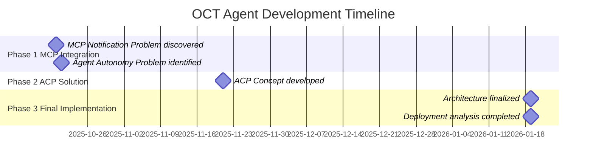
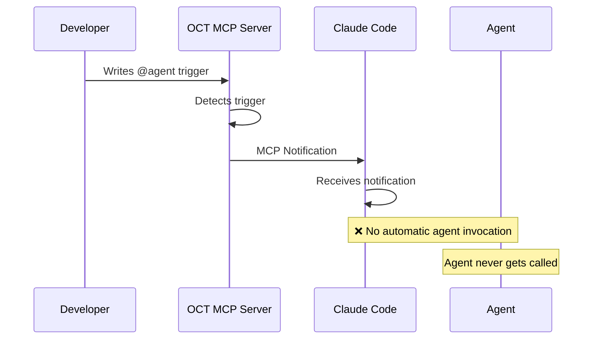
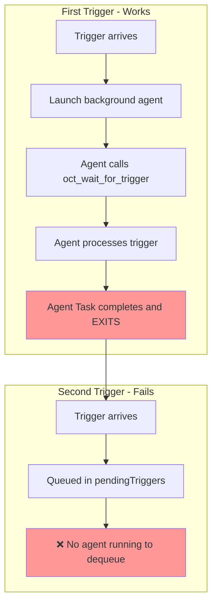
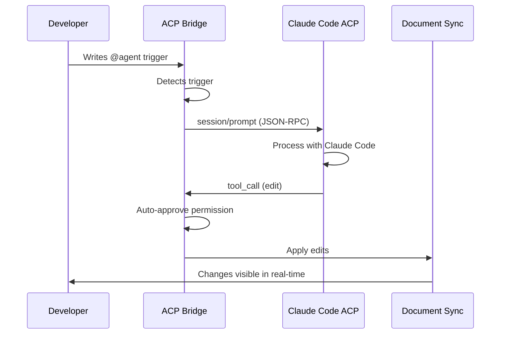
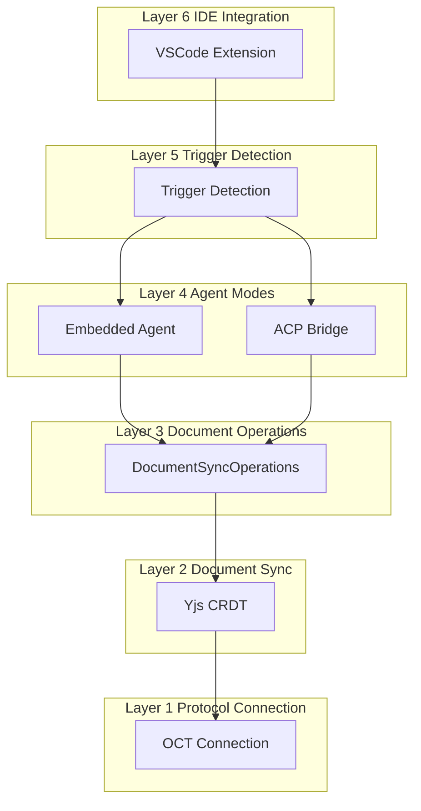
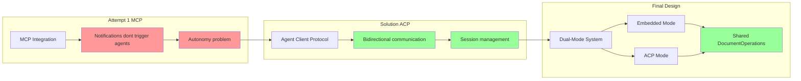

# OCT Agent: Development Journey

**Status:** 📚 Historical Documentation
**Last Updated:** 2026-01-19

## Purpose of This Document

This document chronicles the development journey of the Open Collaboration Tools (OCT) Agent, documenting the architectural decisions, challenges encountered, and solutions implemented. It serves as a guide to understanding **why** the current architecture exists and **how** we arrived at the final design.

## What is the OCT Agent?

The OCT Agent is an AI-powered participant in collaborative coding sessions that can:
- Join OCT sessions as a peer
- Respond to `@agent` triggers in shared documents
- Make real-time code edits visible to all participants
- Operate in two modes: **Embedded** (direct LLM) or **ACP** (external agent integration)

## Development Timeline

## Phase 1: MCP Integration Attempts (October 2025)

### The Initial Vision

The first approach attempted to integrate the agent with Claude Code using the **Model Context Protocol (MCP)**. The idea was elegant:

1. OCT Agent runs as an MCP server
2. Claude Code connects as MCP client
3. When `@agent` triggers are detected, send MCP notifications
4. Claude Code automatically invokes agent to process triggers

### Problem 1: MCP Notification Limitation

**Discovered:** October 20, 2025
**Documented in:** [MCP_NOTIFICATION_PROBLEM.md](MCP_NOTIFICATION_PROBLEM.md)

**What we learned:**
- MCP notifications are **passive information updates**
- Claude Code receives notifications but doesn't automatically invoke agents
- MCP is designed for **client → server** (pull), not **server → client** (push)

**The architectural mismatch:**

**Solutions explored:**
- **Solution A**: Blocking wait tool (`oct_wait_for_trigger`)
- **Solution B**: MCP sampling (server-initiated AI inference)
- **Solution C**: Hybrid auto-detecting approach

**Result:** Solution C was implemented but revealed a deeper problem...

### Problem 2: Agent Autonomy Problem

**Discovered:** October 21, 2025
**Documented in:** [AGENT_AUTONOMY_PROBLEM.md](AGENT_AUTONOMY_PROBLEM.md)

**The core issue:**
- Task agents in Claude Code are designed for **one-off tasks**
- After processing first trigger, agent **terminates automatically**
- No mechanism for persistent background agents
- Subsequent triggers have no agent to process them

**The lifecycle problem:**

**Why this was a fundamental problem:**
- Not a bug in our implementation
- Architectural limitation in Claude Code's Task agent system
- MCP protocol doesn't provide agent lifecycle management
- Workarounds were complex and fragile

**Key insight:** MCP is the wrong protocol for our use case.

### Why MCP Wasn't Ideal

| Aspect | What MCP Provides | What OCT Agent Needs |
|--------|-------------------|---------------------|
| **Communication** | Unidirectional (Client → Server) | Bidirectional (Both ways) |
| **Triggering** | Client decides when to call tools | External events trigger agent |
| **Lifecycle** | Client-managed | Session-managed |
| **Use Case** | Tools/Resources for agents | Agent collaboration |

## Phase 2: ACP Solution (November 2025)

### The Breakthrough: Agent Client Protocol

**Developed:** November 21, 2025
**Documented in:** [ACP_CONCEPT.md](ACP_CONCEPT.md)

**Discovery:** The `@zed-industries/claude-code-acp` package provides proper bidirectional communication with Claude Code through the Agent Client Protocol.

### Why ACP Solved the Problems

**ACP provides:**
- ✅ **Bidirectional communication**: Server can send requests to agent
- ✅ **Event-driven architecture**: External events naturally trigger agent actions
- ✅ **Session-based**: Proper lifecycle management
- ✅ **Direct stdio communication**: Lower latency, simpler flow
- ✅ **Structured tool calls**: Agent gets context and responds with edits

**The ACP flow:**

### The "Switch" Architecture

The solution was to make the OCT Agent a **dual-mode system**:

**Mode A: Embedded Agent**
- Direct LLM integration (Anthropic, OpenAI)
- No external dependencies
- Fast, efficient for simple tasks
- Hardwired workflow

**Mode B: ACP Bridge**
- Integration with external agents (Claude Code, etc.)
- Bidirectional communication via ACP
- Advanced capabilities
- Flexible tool-based workflows

**Key innovation:** The OCT Agent CLI became a "switch" that routes to the appropriate backend based on user preference.

## Phase 3: Final Architecture (January 2026)

### Current Implementation

**Finalized:** January 19, 2026
**Documented in:** [ARCHITECTURE.md](ARCHITECTURE.md)

The final architecture consists of 6 layers:

**Unified interface:** Both modes share the same `DocumentOperations` abstraction, ensuring consistency regardless of which mode is used.

### Deployment Considerations

**Analyzed in:** [REMOTE_AGENT_CHALLENGES.md](REMOTE_AGENT_CHALLENGES.md)

**Key constraint:** Agent must run in workspace directory
- Uses `fs.readFileSync()` for local file access
- No remote file streaming
- `process.cwd()` is workspace root

**Supported scenarios:**
- ✅ Host starts agent (same machine as workspace)
- ⚠️ Participant starts agent (requires manual workspace sync)
- ❌ Remote agent server (no workspace access)

**Design philosophy:** Local-first architecture for simplicity, performance, and security.

## Documentation Roadmap

### For Understanding the Journey

Read in this order to understand the development process:

1. **[DEVELOPMENT_JOURNEY.md](DEVELOPMENT_JOURNEY.md)** (this file) - Overview of the journey
2. **[MCP_NOTIFICATION_PROBLEM.md](MCP_NOTIFICATION_PROBLEM.md)** - First integration attempt
3. **[AGENT_AUTONOMY_PROBLEM.md](AGENT_AUTONOMY_PROBLEM.md)** - Why MCP failed
4. **[ACP_CONCEPT.md](ACP_CONCEPT.md)** - The solution
5. **[ARCHITECTURE.md](ARCHITECTURE.md)** - Final implementation

### For Using the Agent

Read in this order if you just want to use it:

1. **[README.md](README.md)** - Getting started guide
2. **[ARCHITECTURE.md](ARCHITECTURE.md)** - How it works
3. **[REMOTE_AGENT_CHALLENGES.md](REMOTE_AGENT_CHALLENGES.md)** - Deployment scenarios

### For Specific Topics

- **Integration patterns**: [ACP_CONCEPT.md](ACP_CONCEPT.md)
- **Deployment scenarios**: [REMOTE_AGENT_CHALLENGES.md](REMOTE_AGENT_CHALLENGES.md)
- **Architecture layers**: [ARCHITECTURE.md](ARCHITECTURE.md)
- **Historical context**: [MCP_NOTIFICATION_PROBLEM.md](MCP_NOTIFICATION_PROBLEM.md) and [AGENT_AUTONOMY_PROBLEM.md](AGENT_AUTONOMY_PROBLEM.md)

## Architectural Learnings

### 1. Protocol Selection Matters

**Lesson:** Choose protocols based on your communication pattern, not popularity.

- MCP is excellent for client-driven tool access
- ACP is better for event-driven agent collaboration
- The right protocol eliminates workarounds

### 2. Bidirectional Communication is Hard

**Lesson:** Server-initiated actions require proper protocol support.

What we learned:
- Notifications are not the same as requests
- Polling and blocking are workarounds, not solutions
- Agent lifecycle management needs to be built into the protocol

### 3. Simplicity Through Abstraction

**Lesson:** Shared abstractions enable flexibility.

The `DocumentOperations` interface:
- Allows both Embedded and ACP modes to coexist
- Makes testing easier (mock the interface)
- Enables future additions without breaking existing code

### 4. Document the Journey, Not Just the Destination

**Lesson:** Historical context helps future developers understand "why."

Benefits:
- New team members understand design decisions
- Avoids repeating past mistakes
- Provides justification for current architecture
- Helps evaluate when to reconsider decisions

### 5. Local-First is a Feature, Not a Limitation

**Lesson:** Constraints drive good design.

The local workspace requirement:
- Eliminates file streaming complexity
- Improves performance (no network latency)
- Enhances security (no workspace upload)
- Simplifies implementation

Trade-off: Remote deployment requires different approach, but that's okay.

## Key Milestones

| Date | Milestone | Significance |
|------|-----------|--------------|
| 2025-10-20 | MCP Notification Problem discovered | First attempt at integration, learned MCP limitations |
| 2025-10-21 | Agent Autonomy Problem identified | Understood fundamental architectural mismatch |
| 2025-11-21 | ACP Concept developed | Found the right protocol for the job |
| 2026-01-19 | Architecture finalized | Dual-mode system with shared abstractions |

## Evolution Summary

## Conclusion

The OCT Agent development journey demonstrates that:

1. **First solutions aren't always the best solutions** - MCP seemed ideal but had fundamental limitations
2. **Understanding protocols deeply matters** - Knowing the difference between MCP and ACP was crucial
3. **Flexibility through abstraction pays off** - The dual-mode system serves different use cases
4. **Documentation is a gift to future developers** - This journey guide helps others understand the "why"

The current architecture is not just the result of implementation, but the result of learning, iterating, and finding the right tools for the job.

## Related Documentation

### Historical Context
- [MCP_NOTIFICATION_PROBLEM.md](MCP_NOTIFICATION_PROBLEM.md) - First integration challenge
- [AGENT_AUTONOMY_PROBLEM.md](AGENT_AUTONOMY_PROBLEM.md) - Lifecycle problem with MCP

### Current Implementation
- [ARCHITECTURE.md](ARCHITECTURE.md) - Complete architecture overview
- [ACP_CONCEPT.md](ACP_CONCEPT.md) - ACP integration design
- [README.md](README.md) - User guide and getting started

### Deployment
- [REMOTE_AGENT_CHALLENGES.md](REMOTE_AGENT_CHALLENGES.md) - Deployment scenarios and constraints

### Other
- [CHAT_CONCEPT.md](CHAT_CONCEPT.md) - Future: Chat-based triggering
- [CLAUDE_CODE_PLUGIN_CONCEPT.md](CLAUDE_CODE_PLUGIN_CONCEPT.md) - Claude Code integration details
- [CODE_ANALYSIS.md](CODE_ANALYSIS.md) - Code structure and implementation details
